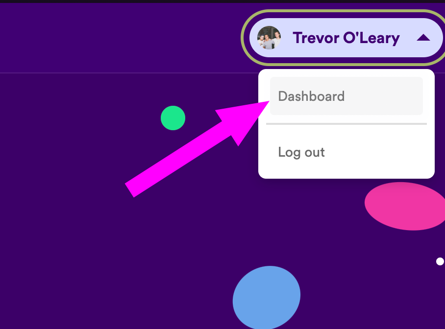
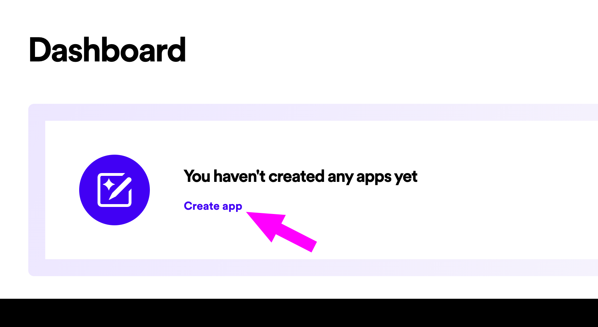
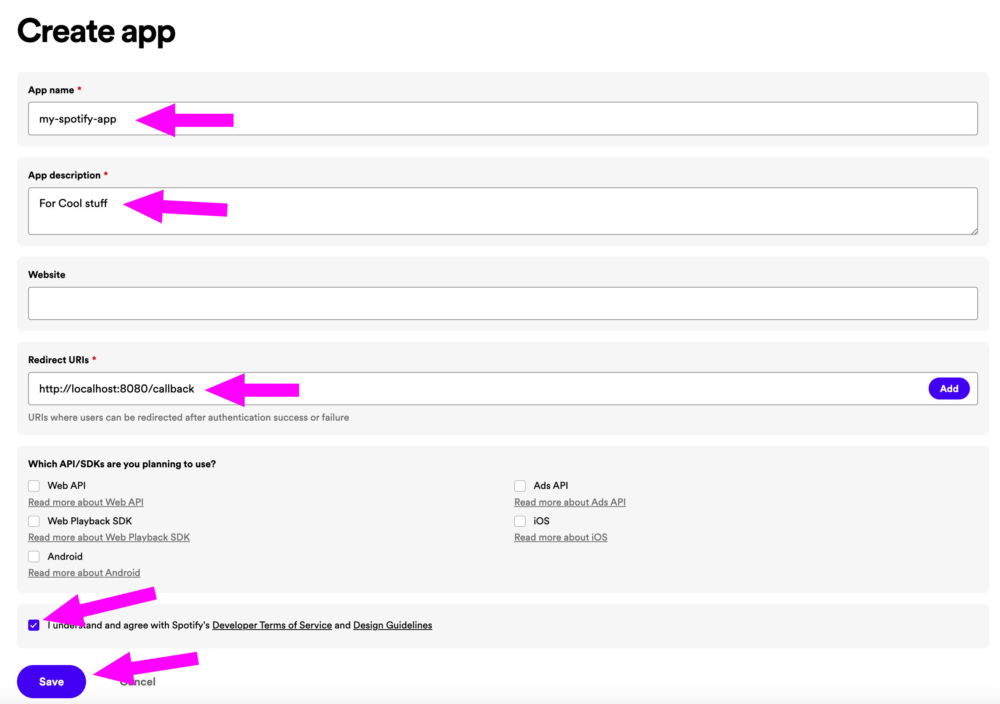
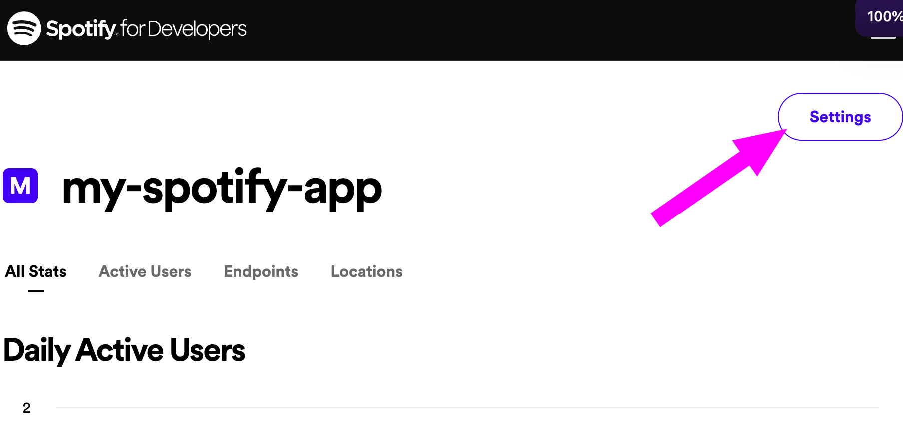
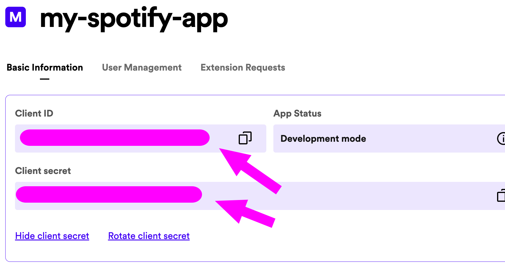
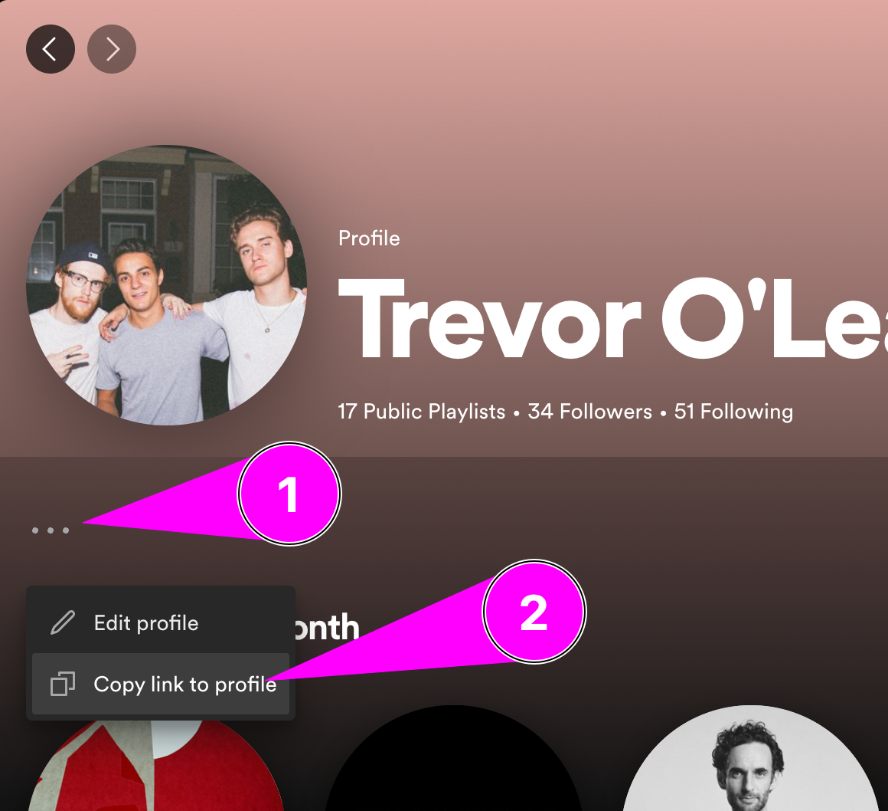
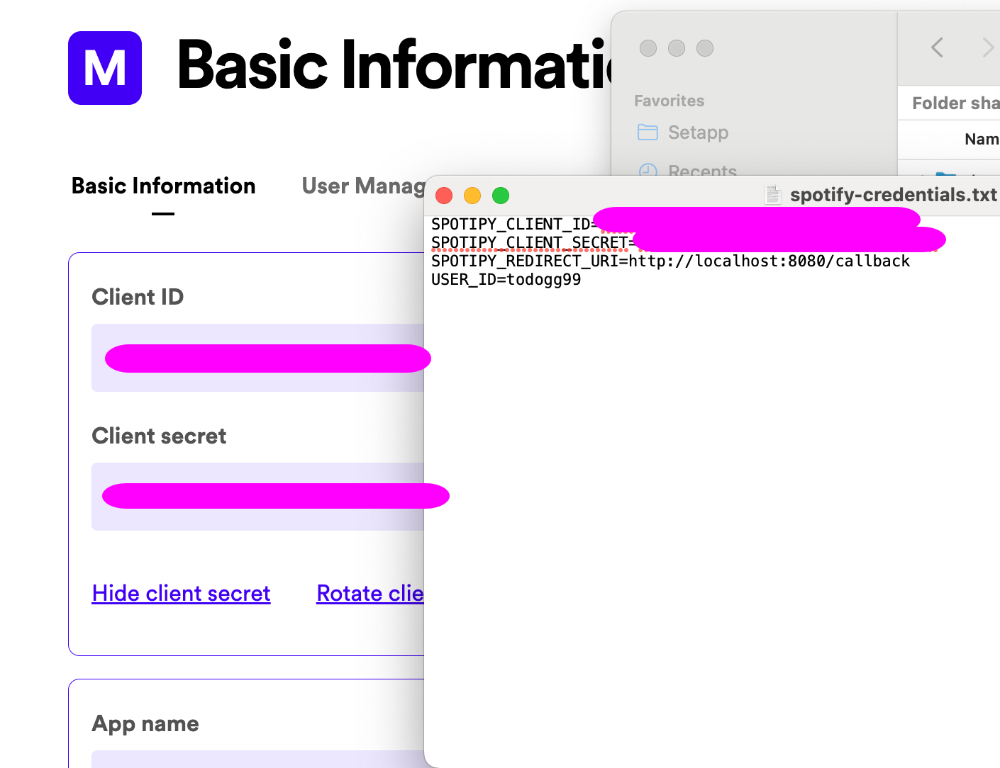

# Getting Started
Log Into [Spotify Developer Dashboard](https://developer.spotify.com/documentation/web-api) with your normal spitify account.

1. Open Dashboard:

2. Create an App

3. Fill in information

    1. Redirect URL http://localhost:8080/callback is important
4. Once Saved. Go to Settings

5. Save these codes Somewhere for now

6. Get your profile ID

https://open.spotify.com/user/todogg99?si=c80915343f61409e
Mine is todogg99 as you can see in the link...
7. Run the application once and close the terminal
8. Fill in the codes in the text file it created

9. Run the application again! and you're in business
